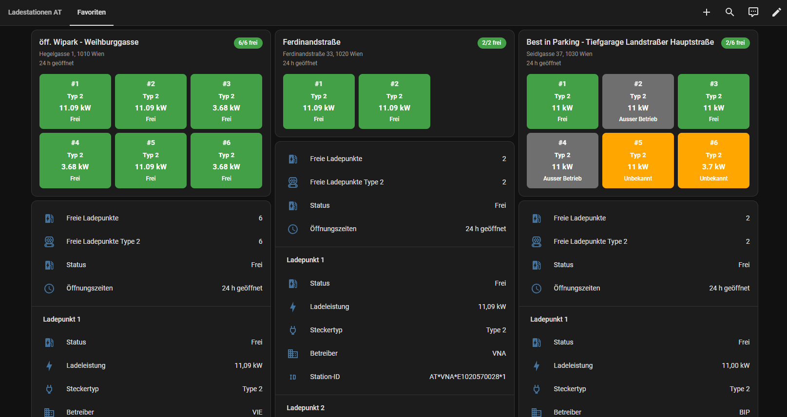
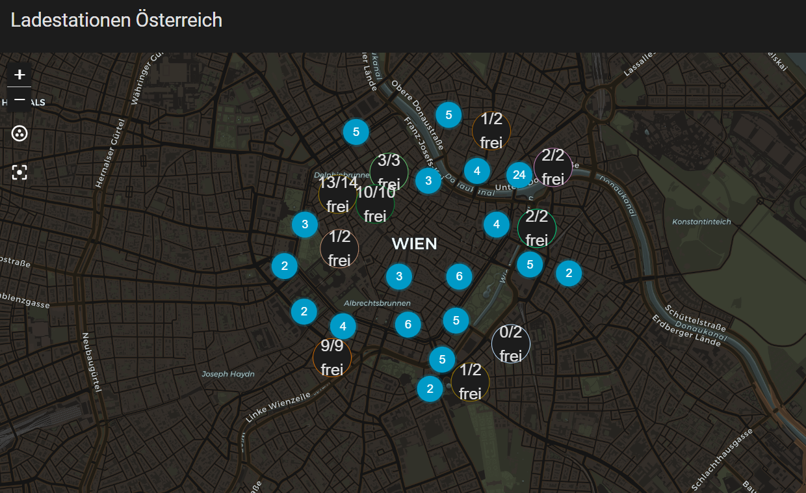

# Austrian Charging Stations (ladestellen.at)

[](https://github.com/hacs/integration)
[](LICENSE)
<a href="https://www.buymeacoffee.com/prusuino"></a>

A Home Assistant custom integration that shows real-time availability of public EV charging stations in Austria, sourced from the official national charging point directory **ladestellen.at** (E-Control).

## Background

ladestellen.at is Austria's national charging point directory (Ladestellenverzeichnis), operated by the regulator E-Control. Operators of publicly accessible charging points are legally required to report their stations there — including the **real-time status (available / charging / out of order) of every charge point** — so the directory covers the entire Austrian public charging network (~39,000 charge points) with live data, plus ad-hoc prices per kWh. This integration offers three independent ways to use that data, chosen when you add the integration:

- **Radius overview** — the nearest stations around a location, each site as a `geo_location` entity so they show up automatically on any Map card, plus live-adjustable filters.
- **Favorite charge point** — pin exactly one specific charge point you care about (e.g. your regular charger), independent of any location or radius. Repeatable — add the integration again for another favorite.
- **Favorite site** — pin an entire physical charging site (all its charge points combined into one device). Repeatable, same as above.

## API key

The ladestellen.at API is free but requires a personal API key:

1. Register at **https://admin.ladestellen.at/#/api/registrieren** and accept the terms of use.
2. When asked for the authorized domain, enter **`homeassistant.local`** — the integration identifies itself with that domain, so the key only works if it was registered for it.
3. The key arrives by e-mail. Enter it when adding the integration; further entries prefill it automatically.

## What it provides

### Radius overview

| Entity | Type | Description |
|---|---|---|
| `geo_location.ladestation_...` | Geo-location | One per matching charging **site** (charge points at the same station are grouped). State = distance from your configured location (km). The map label shows availability — "6/7 available" for multi-connector sites, the plain status for single chargers — refreshed live on every update. Attributes: available/total count, max power (kW), plug types, operator, address, opening hours. |
| `sensor.at_charging_stations_available_<radius>km` | Sensor | Count of currently available charge points matching the active filters within the radius. Attributes include totals, active filter values, the plug types/operators found in range, and `available_by_plug_type` — the available count per plug type as a dictionary. |
| `sensor.at_charging_stations_available_<radius>km_<plug>` | Sensor | Optional, one per plug type selected in the integration's **Configure** dialog (e.g. `..._ccs`, `..._type2`): count of available charge points offering that plug type. Respects the minimum-power and operator filters but ignores the live plug-type/status filters — filtering the map to Type 2 doesn't zero your "free CCS" count. |
| `number.at_charging_stations_min_power_kw` | Number | Minimum power filter (kW) — e.g. set to 50 to only show fast chargers. Takes effect immediately. |
| `select.at_charging_stations_plug_type` | Select | Plug type filter (see plug families below). |
| `select.at_charging_stations_status` | Select | Availability filter: all / available only / occupied only. |
| `select.at_charging_stations_operator` | Select | Operator filter, options discovered dynamically from stations in range. |

Filter changes via the `number`/`select` entities apply immediately — no waiting for the next poll. Data is refreshed every 5 minutes.

The per-plug-type sensors are enabled in the integration's **Configure** dialog (Settings → Devices & services → Austrian Charging Stations → Configure). Selecting or deselecting a type adds or removes its sensor immediately, no restart needed.

**Note:** the source API returns the ~100 nearest stations per query, so in very dense areas (city centers) a radius entry covers the 100 nearest sites regardless of the configured radius.

### Plug families

The registry reports connector types in two coexisting vocabularies (legacy keys and OCPI-style keys). The integration normalizes both into eight canonical plug families used everywhere — filters, sensors, and the card: **Type 2, CCS, CHAdeMO, Tesla, Type 1, Household, CEE / Industrial, Other**.

### Favorite charge point

| Entity | Type | Description |
|---|---|---|
| `sensor.at_charging_station_favorite_<name>` | Sensor | Current status (available / occupied / out of service). Attributes include the finer-grained raw registry status (`at_status`: AVAILABLE / CHARGING / RESERVED / BLOCKED / ...), the ad-hoc price (`price_cent_kwh`), and the operator's green-energy declaration. |
| `sensor.at_charging_station_favorite_<name>_power_kw` | Sensor | Charging power (kW), as its own graphable sensor. |
| `sensor.at_charging_station_favorite_<name>_plug_type` | Sensor | Plug type(s) of the charge point. |
| `sensor.at_charging_station_favorite_<name>_operator` | Sensor | The charge point's operator. |
| `sensor.at_charging_station_favorite_<name>_station_id` | Sensor | The charge point's EvseID (diagnostic). |

A pre-filled card listing all five is also added automatically to a "Favorites" view on the [automatic dashboard](#automatic-dashboard).

### Favorite site

| Entity | Type | Description |
|---|---|---|
| `sensor.at_charging_station_favorite_location_<name>` | Sensor | State = number of currently available charge points at the site. Attributes: total charge point count, `available_by_plug_type`, derived site status, address, and a `connectors` list with each charge point's own status, raw registry status, power (kW), plug type, and price. |
| `sensor.at_charging_station_favorite_location_<name>_available_<plug>` | Sensor | One per plug type present at the site (e.g. `..._available_ccs`): number of currently available charge points offering that plug type. Created automatically. |
| `sensor.at_charging_station_favorite_location_<name>_status` | Sensor | Derived overall site status: available / occupied / **closed** (outside opening hours) / out of service. Localized state; raw `site_status` attribute for automations. |
| `sensor.at_charging_station_favorite_location_<name>_connector_<n>_status` | Sensor | Current status of charge point `<n>` at the site. |
| `sensor.at_charging_station_favorite_location_<name>_connector_<n>_power_kw` | Sensor | Charging power (kW) of charge point `<n>`. |
| `sensor.at_charging_station_favorite_location_<name>_connector_<n>_plug_type` | Sensor | Plug type(s) of charge point `<n>`. |
| `sensor.at_charging_station_favorite_location_<name>_connector_<n>_operator` | Sensor | Operator of charge point `<n>`. |
| `sensor.at_charging_station_favorite_location_<name>_connector_<n>_station_id` | Sensor | The charge point's own EvseID (diagnostic). |

One set of these five per charge point is created automatically. A pre-filled card listing all of them is also added automatically to a "Favorites" view on the [automatic dashboard](#automatic-dashboard).

Favorites (charge point or site) intentionally have no `geo_location` map marker — the radius overview already covers map display, so a favorite is tracked purely via its sensors, keeping the map free of clutter.

All favorite entities refresh live (every 5 minutes), independent of any radius overview you may also have configured.

## Bundled Lovelace card

The integration ships its own Lovelace card, `austrian-charging-stations-card`, showing colored per-connector status boxes — green for available, red for occupied, gray for out of service, blue while the site is closed (outside its opening hours), yellow when the operator reports no usable status — each box with the charge point's plug family, charging power, and status. Clicking a box opens the charge point's more-info dialog.

The header shows the site name, its address, and the weekly opening hours with consecutive days collapsed ("Mon–Fri 08:00–20:00 · Sat 07:30–18:00", or "Open 24 h"). The badge in the corner shows live availability ("3/8 available" — green while at least one charge point is free, red when all are taken) and switches to "Closed" outside opening hours, "Closed today" on full-day closures, or "Out of service" when nothing at the site is in service.

It works for both favorite kinds: a whole site shows one box per charge point; a single favorite shows one box.



The card registers itself automatically (no manual resource setup) and is used on the auto-generated "Favorites" dashboard view. It is also available in the card picker as **Austrian Charging Stations Card** for use anywhere else, with a visual editor for all options:

```yaml
type: custom:austrian-charging-stations-card
entity: sensor.at_charging_station_favorite_location_<name>  # or a single favorite's status sensor
title: My charging site  # optional
plug_types:  # optional: show only these plug families (multi-select in the visual editor)
  - CCS
```

With a `plug_types` filter, boxes of other plug families are hidden and the availability badge counts only the visible charge points. The filter is purely visual — the favorite, its sensors, and the dashboard entities list keep covering the whole site.

## Language

Entity names, the device name, and the dropdown filter values adapt automatically to your Home Assistant language setting — German, English, French, and Italian are supported, with English as the fallback for any other language. Plug family and operator names from the source data are shown as-is.

## Automatic dashboard

On first setup, the integration automatically creates a **"Charging Stations AT"** dashboard (title localized to your HA language) with a full-screen native Home Assistant Map card, already configured to display each site's availability directly on its marker. This only happens once: if you later customize or delete that dashboard yourself, the integration won't touch or re-create it. Note that after deleting it, its sidebar entry disappears with the next restart (a Home Assistant limitation for integration-registered panels).



Favoriting a charge point or a whole site adds a second view, **"Favorites"**, to that same dashboard with a pre-filled Entities card per favorite — feel free to edit or delete it, though it's kept in sync with the favorite's current charge points on every restart.

## Installation

### HACS (recommended)

1. In HACS, go to **Integrations → ⋮ → Custom repositories**, add this repository URL with category **Integration**.
2. Search for **"Austrian Charging Stations"** and install.
3. Restart Home Assistant.

### Manual

1. Copy the `custom_components/ladestellen_at` folder into your Home Assistant `config/custom_components/` directory.
2. Restart Home Assistant.

## Setup

1. Get your free API key (see [API key](#api-key) above).
2. Go to **Settings → Devices & Services → Add Integration**.
3. Search for **"Austrian Charging Stations (ladestellen.at)"**.
4. Choose a mode:
   - **Radius overview**: enter your API key; latitude/longitude default to your Home Assistant home location, set the radius (km). Done — add the integration again for a different location or radius. Adjust the filters afterwards via the `number`/`select` entities.
   - **Favorite charge point**: enter the charge point's EvseID directly (printed on the charger, e.g. `AT*DAE*E0002115`), or leave it empty and search near a location instead — optionally narrowed by minimum power and plug family — then pick one from the resulting list. The list also includes whole sites (marked with 📍 and their charge point count) alongside individual charge points — pick one of those instead to favorite the entire site. Add the integration again for another favorite.

## Notes

- Only relevant for locations in or near Austria.
- Data quality/freshness varies by charging network operator — some feeds update within minutes, others less frequently. This reflects the operators' own reporting, not a limitation of this integration.
- This integration is unofficial and not affiliated with, endorsed by, or supported by E-Control or ladestellen.at. It only reads the directory's published data via the official public API.
- If the source API is unreachable, entities simply stop updating rather than showing incorrect data.

## Data source & license

This integration reads live data from the official ladestellen.at API (E-Control). Use of the API requires a personal key and acceptance of E-Control's terms — see [NOTICE.md](NOTICE.md) for details. Every entity sets Home Assistant's `attribution` attribute accordingly.

## Disclaimer

This integration is provided **as-is, without any warranty**. Data is retrieved from a third-party published source and may be inaccurate, delayed, incomplete, or unavailable. Do not rely on it as your sole source for trip planning or safety-critical decisions — always verify availability directly at the charging station or via the operator's own app before relying on it. The author(s) accept **no responsibility or liability** for any damage, financial loss, incorrect readings, or other issues arising from using this integration, whether it stops working, behaves unexpectedly, or never worked correctly for your setup in the first place.

## License

Source code: MIT — see [LICENSE](LICENSE). Charging station data: see [NOTICE.md](NOTICE.md) for the required attribution.

## Support

If this integration is useful to you, you can support its development:

<a href="https://www.buymeacoffee.com/prusuino"></a>
